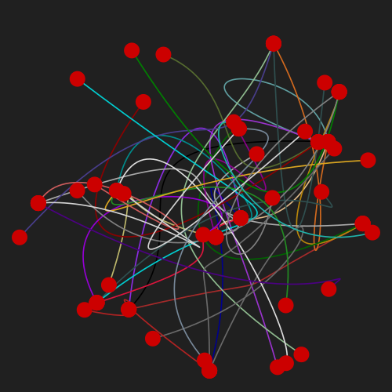
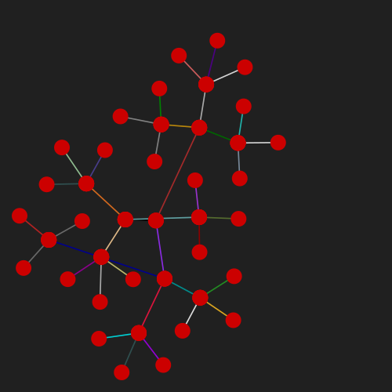
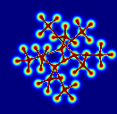
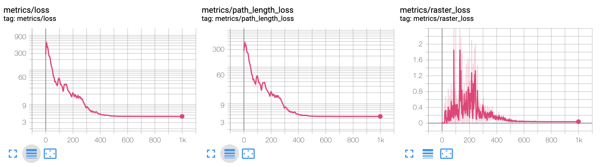

## Degraph
*Degraph* is a demonstrative [differentiable programming](https://en.wikipedia.org/wiki/Differentiable_programming) project.
The main idea is treating the plot of a [graph](https://en.wikipedia.org/wiki/Graph_%28discrete_mathematics%29) as a *differentiable function*.
The plot is associated with a loss function that represents the goodness of the plotting operation.
The combination of differentiable representation (differentiable plot) and the loss opens the way to the application of
an optimizer (eg. gradient descent) which can be used to optimize the "design".
The implementation is based on [Tensorflow](https://www.tensorflow.org/) 2.0 and Python 3.7.

The graphical representation of a graph is realized by plotting small discs on a 2D canvas for vertexes and
[Bezier](https://en.wikipedia.org/wiki/B%C3%A9zier_curve) curves of third degree for the edges.
The positions of the vertexes and the control points of the edges (bezier) are the variables of the model.
The optimization process starts with a graph where the vertexes and edges control points are initialized randomly, here
is an example of the initial state and the result after the optimization is applied.

Initial state                     | Final state 
:--------------------------------:|:-------------------------:
 | 

Also an animation of the iteration of the optimizer (gradient descent) is available on [youtube](https://youtu.be/vmNoHZ1yCak).

Internally the interactions between the various elements of the graph are represented by a *differentiable raster* (image),
specifically, [radial basis functions](https://en.wikipedia.org/wiki/Radial_basis_function) are the core component of
the graphical entities. Here is an example of RBF network representing a graph.

The platform is highly customizable, specifically the components of the graph are represented as entities
(see [entity.py](degraph/entity.py)) that can be connected in different configurations,
a simple example is available [here](examples/test1.py).
Tensorboard is also supported, here is an example output.

More detailed documentation coming soon...

